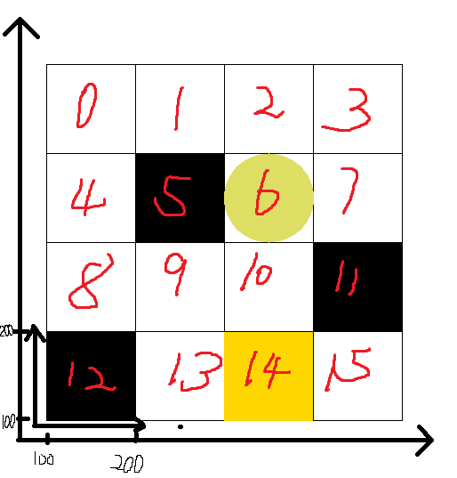
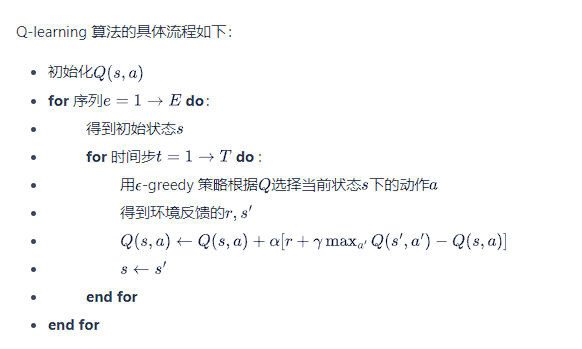

# Find Golden

## Environment


黑色方块是障碍，黄色方块是目标，圆球是当前位置
上下左右移动，每次reward=-1，碰到黑色方块reward=-10，碰到黄色方块reward=1

### 代码
可以仿照 gym目录\gym\envs\classic_control\cartpole.py的文件来写
具体参考gridmap.py

其中的render()函数画图参考[pygame.gfxdraw函数](https://blog.csdn.net/qq_41556318/article/details/86305564)

## qlearning


## 环境的注册
1. 将我们自己的环境文件（我创建的文件名为gridmap.py)拷贝到gym安装目录/gym/gym/envs/classic_control文件夹中。
2. 打开该文件夹/gym/gym/envs/classic_control下的__init__.py文件，在文件末尾加入语句：
```from gym.envs.classic_control.gridmap import GridMap```
3. 进入文件夹你的gym安装目录/gym/gym/envs，打开该文件夹下的__init__.py文件，添加代码：
```
register(
    id="Find-Golden",
    entry_point="gym.envs.classic_control:GridMap",
    max_episode_steps=20000,
    reward_threshold=100.0
)
```

## 运行
执行run.py
